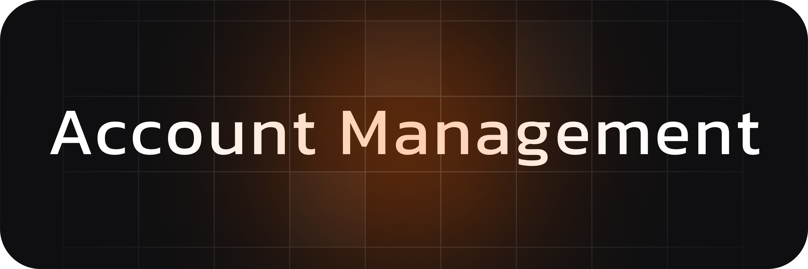

# Account Management

Proper account management is really important in keeping your digital identity and personal information safe from potential threats and privacy breaches. It involves not only creating strong, unique passwords and using secure authentication methods but also being mindful of the information you share online.

## Account Creation
Often, we sign up for things without really considering them. This could be anything from a streaming service for keeping up with new episodes of our favourite TV show to an account with additional perks when buying items online. Nonetheless, it's important to think about the consequences on your privacy now and in the future. 

Deleting accounts on some services can sometimes be hard to do.

### Terms of Service & Privacy Policy
The ToS are the rules that you agree to follow when using the service.

The Privacy Policy is how the service says they will use your data.

Let's be honest, almost no one really reads the terms of service or privacy policy but we agree to them all the time. We recommend [this site](https://tosdr.org/) to help fix this problem.

### Personal Details
Avoid giving out your real personal information if you can. You can use one identity for each service, but ensure it is not authentic.

### Authentication methods
There are multiple ways to sign up for an account, each with their own advantages and disadvantages.

Always use [MFA](/understanding/authentication#multi-factor-authentication) (**not SMS to prevent [Sim Swapping](https://wikiless.tiekoetter.com/wiki/SIM_swap_scam?lang=en) attacks**) when available to secure your accounts.

#### Email and password
The most common way to create a new account involves using an email address and password. When using this method, you should use a [password manager](/recommendations/software/password-managers) and follow [best practices](/understanding/authentication#best-practices) regarding passwords.

#### OAuth (Sign in with...)
OAuth, which stands for "Open Authorization", is an authentication protocol allowing registration for a service via another account without sharing much info. **"Sign in with *provider name*"** links to OAuth. When using OAuth, choose a provider to open a login page, connecting your accounts without sharing passwords, though basic info is shared. This process is needed each login.

Advantages:

- **Security:** Trust in external OAuth provider's secure practices like Apple or Google.
- **Ease of use:** Manage multiple accounts with one login.

Disadvantages:

- **Privacy:** OAuth provider knows your services.
- **Centralization:** Compromised OAuth account affects all linked accounts.

Additional Considerations:

- **Data Sharing:** OAuth involves bidirectional data sharing, where both the service and the OAuth provider exchange information. Users should be cautious of the data permissions requested by services during OAuth login to avoid unnecessary exposure of personal information.

- **Session Management:** There's a risk of session hijacking in OAuth implementations if proper session management practices are not followed by service providers. Regularly reviewing active sessions and logging out from unused sessions can mitigate this risk.

OAuth enhances service integration; use it selectively and secure main accounts with MFA. Services using OAuth are secure as your provider’s account. Be cautious of bidirectional data sharing and potential session hijacking in OAuth logins.

#### Phone Number
You should avoid giving out your real phone number if you can.

## Account Deletion
Over time, it can be easy to accumulate a number of online accounts, many of which you may no longer use. Deleting these unused accounts is an important step in reclaiming your privacy, as dormant accounts are vulnerable to data breaches. A data breach is when a service's security is compromised and protected information is viewed, transmitted, or stolen by unauthorized actors. Data breaches are unfortunately all too common these days, and so practicing good digital hygiene is the best way to minimize the impact they have on your life. The goal of this guide then is to help navigate you through the irksome process of account deletion, often made difficult by deceptive design, for the betterment of your online presence.

### Finding Old Accounts
If you didn't use a password manager before or think you might have old accounts not saved there, you can check your email for them. Search for words like "verify," "active," or "confirm." Most online services send a verification link to your email when you sign up, so this can help you find old accounts you forgot about.

### Deleting Old Accounts
Deleting your account on different websites can be handled in various ways. Some sites make it easy by offering a "Delete Account" option, while others may require you to contact support. On certain sites, deleting your account might not even be possible.

You can check [JustDeleteMe](https://justdeleteme.xyz/) for instructions on deleting the account for a specific service.

For services that don't allow account deletion, the best thing to do is to overwrite the account information with fake data, change the password to a randomly-generated one and enable MFA. Then you can safely forget about this account.

Even if you can delete your account, your info might not all get removed.

### Avoid New Accounts
Before ever making a decision about creating a fresh account, look at yourself in the mirror and question yourself, "Do I really need this?".