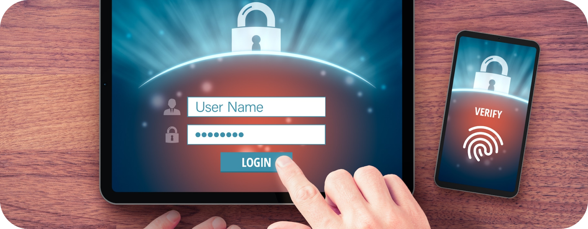

# Authentication

Authentication serves as the first line of defense against unauthorized access to systems, applications, and data. It ensures that individuals or systems attempting to access resources are who they claim to be, thereby protecting against identity theft, data breaches, and fraud. Without effective authentication measures, sensitive information such as financial details, personal communications, and intellectual property could be compromised.

## Best Practices

### Creating Strong Passwords

Strong passwords typically include a mix of alphanumeric characters (both uppercase and lowercase), symbols, and are at least 12 characters long. Avoid using easily guessable information such as names, birthdays, or common words. Instead, aim to create passwords that are unique, complex, and difficult for automated tools to crack.

### Use Unique Passwords

Using unique passwords for each account is crucial because it prevents a single data breach from compromising multiple accounts. When one password is reused across different platforms, it increases the risk of widespread unauthorized access if any one of those services is breached. Therefore, generating and using different passwords for each online account ensures that even if one password is compromised, the others remain secure.

### Use Random Passwords

Randomly generated passwords are significantly more secure than easily guessable passwords or patterns. Password generators can create complex combinations of letters (both uppercase and lowercase), numbers, and symbols that are difficult for attackers to crack using brute force methods. It's recommended to use password generators built into reputable password managers or standalone generator tools to ensure randomness and strength.

All of [our recommended password managers](/recommendations/software/password-managers) include a built-in password generator that you can use.

### Rotating Passwords

Regularly changing passwords is a good practice, especially for sensitive accounts. While frequent password changes were previously emphasized, current guidance suggests focusing more on using strong, unique passwords rather than frequently changing them. However, for critical accounts or where mandated by policy, periodic password changes can still provide additional security against long-term exposure.

### Diceware Passphrases

Diceware passphrases are generated by rolling dice to select random words from a list. These passphrases are easier to remember than random strings of characters while still offering high security. The randomness and length of diceware passphrases make them resilient against common password cracking methods.

An example of a diceware passphrase is `android decompose rocking bacon wrecking unshipped bunkbed skirt`.

We recommend using [EFF's large wordlist](https://www.eff.org/files/2016/07/18/eff_large_wordlist.txt) to generate your diceware passphrases.

## Storing Passwords

### Password Managers

Password managers are essential tools for securely storing and managing passwords. They eliminate the need to remember multiple complex passwords and reduce the temptation to reuse passwords across different accounts. A good password manager not only securely stores passwords but also helps generate strong, unique passwords for each account. It's important to choose reputable password managers that offer robust encryption and have a history of trustworthy security practices.

[List of recommended password managers](/recommendations/software/password-managers)

::: warning Keep your TOTP codes in a [separate app](/recommendations/software/multi-factor-authentication).

:::

### Backups

Regularly backing up your passwords is vital to prevent losing access due to hardware failures, accidental deletion, or other unforeseen circumstances. Backups should be stored securely, such as in an encrypted file stored on a separate device or in a secure cloud storage service. By maintaining backups, you can ensure that even if you lose access to your primary password storage, you can recover your passwords and regain access to your accounts.

## Multi-Factor Authentication
::: danger WARNING
Do not use SMS as MFA to prevent [Sim Swapping](https://wikiless.tiekoetter.com/wiki/SIM_swap_scam?lang=en) attacks
:::

### Two-Factor Authentication (2FA)

2FA adds an extra layer of security by requiring users to provide two forms of identification before accessing an account. This typically involves something you know (password) and something you have (like a smartphone or hardware token). Enabling 2FA wherever possible significantly enhances the security of online accounts by making unauthorized access more difficult, even if passwords are compromised.

### Passkeys

Passkeys are cryptographic keys used for authentication purposes, particularly in environments requiring high security standards such as SSH authentication. Passkeys are highly secure because they are difficult to forge or guess, making them ideal for protecting sensitive data or systems. Implementing passkeys enhances security beyond traditional password-based authentication methods.